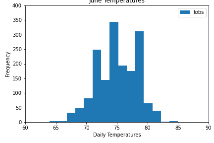
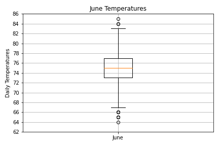
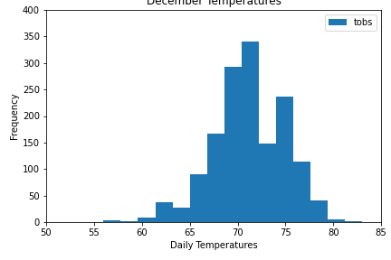
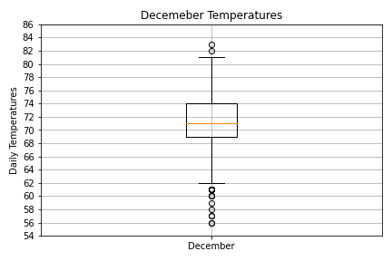

# Surfs_up
Climate Analysis of Oahu. 

## Overview of the analysis: 
In this analysis, we are examining data of the daily temperatures for June and December in Oahu, in order to determine if a surf and ice cream shop business is sustainable year-round on the island. We used Python, Pandas functions, and methods, and SQLAlchemy to filter the data collected from weather stations into dataFrames on which we were able to perform statistical analysis and create graphs of the data.  

## Results: 
The data analysis for the June and December temperatures revealed many interesting and encouraging things that make use believe that a Surf and Ice Cream shop would be a great investment in Oahu. 

  -  The average temperature for the two months are very similar with an average of 75 degrees in June and 71 Degrees in December. These averages can be seen as the red lines in the middle of the box plots shown below. 

  - The temperatures for June ranged between 64 and 84 on the extreme ends, with the half of the days' temperatures being between 73 and 77 degrees, and the large majority of the data being between 67 and 83. There are 3 days that were below 67 (seen as small dots below the box plot in the chart below), which are considered uncommon outliers in the data set. 
  
              

  - The temperatures for December ranged from 56 to 83 on the extreme ends, with the half of the days' temperatures being between 69 and 74 degrees, and the large majority of the data being between 62 and 81. The days below 62 would all be considered uncommon and are designated as outliers in the below box plot with the small dots. 
  
              

## Summary:

As you can see from the data analysis and charts shown above, the temperatures in Oahu are stable within a moderate range that is great for Surfing and Ice Cream consumption. The average temperatures in the middle of winter are not much colder than those of the Middle of summer. This steady range is great for a year-round stream of patrons. 

Additional analysis could be performed on the amount of precipitation during the months of June and December (and beyond) to see how it correlates to the temperatures. If the temperatures are still warm with the rain, then it can be argued that the rain will not significantly change buying habits in the shop.

Another consideration would be the average daily, and/or monthly precipitation during these (and other) months. If the average daily precipitation is low, that would indicate that even if it is raining, there is not often a hard rain that will disrupt people's desire to surf or eat ice cream. Overall, we believe that the data supports investing in a combined Surf and Ice Cream Shop on the Island of Oahu. 

